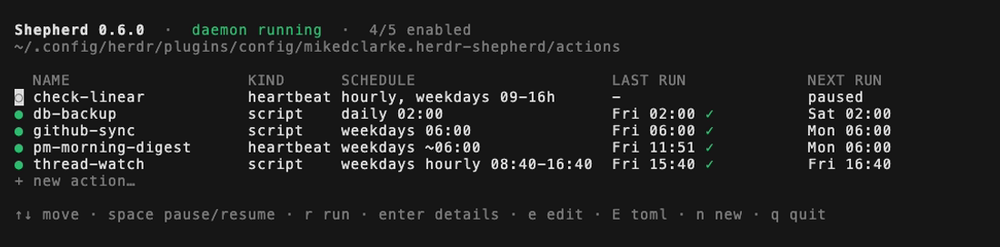
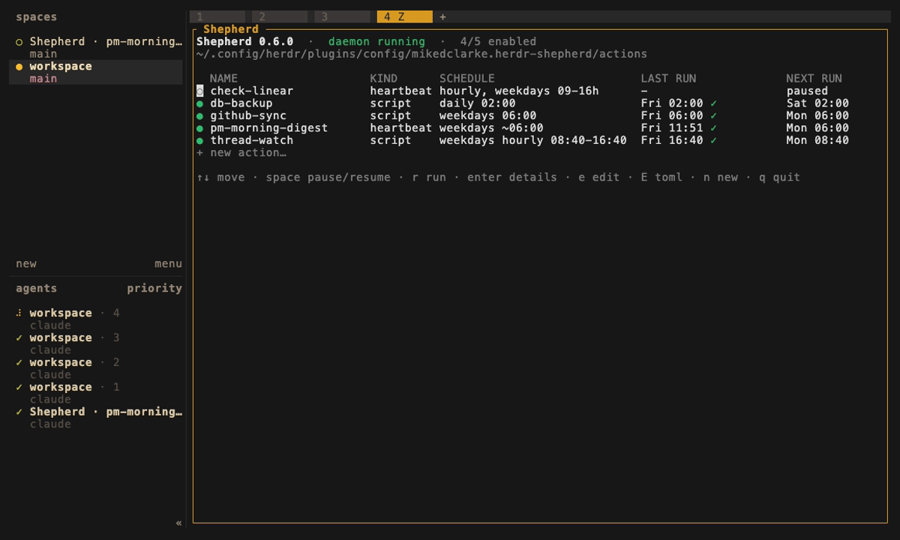

# herdr-shepherd

[](https://github.com/mikedclarke/herdr-shepherd/releases)
[](https://herdr.dev)
[](LICENSE)

Shepherd is a [herdr](https://herdr.dev) plugin that runs your coding agents on a schedule: an inbox triage every hour, a morning digest at six, a repo sync overnight. Every run opens as a real workspace in the herd, where you can watch it work, catch it when it blocks, and review what it did.

herdr shows you what your agents are doing. Shepherd decides when they run.



## What it does

- **Heartbeats**: run an agent with a prompt every N minutes, optionally only within working hours.
- **Routines**: run an agent on a schedule (weekdays at 9, monthly on the 1st, or any cron expression).
- **Scripts**: run plain commands on the same schedules, with timeouts.

Agent runs use herdr's native agent-state detection (working / blocked / done / idle), so a heartbeat stuck on a permission prompt is a visible `blocked` pane and a notification, not a silent background failure. Scripts run headlessly with their output captured in the run log.

## Install

Requires herdr ≥ 0.7.0 on Linux or macOS. Shepherd is POSIX-only (unix sockets, process groups, and kernel file locks), so there is no Windows build.

```bash
herdr plugin install mikedclarke/herdr-shepherd
```

Or from a checkout:

```bash
sh scripts/build.sh
herdr plugin link /path/to/herdr-shepherd
```

`scripts/build.sh` prefers a local Go toolchain (an exact build of the source you have) and falls back to `scripts/install.sh`, which downloads the matching prebuilt binary for your OS and architecture from the GitHub release and checks it against the release's `SHA256SUMS`. No Go toolchain is required.

Installing registers `Shepherd: Board` and `Shepherd: Status` as plugin actions, and a startup hook that spawns the scheduler daemon whenever the herdr server starts. herdr has no built-in menu for plugin actions; reach them with a keybinding (below) or `herdr plugin action invoke`.

### First run

The startup hook only fires when the herdr server starts, so after a fresh `plugin install` *or* `plugin link` the daemon is not running yet. The simplest fix is to restart the herdr server, which fires the hook.

To start it by hand instead, run these from a pane **inside herdr**. The binary lives in the plugin's own directory, not on your `$PATH`, so `cd` there first: for a GitHub install that is herdr's clone of the plugin (below); for a `plugin link`, it is your checkout.

```bash
cd ~/.config/herdr/plugins/github/mikedclarke.herdr-shepherd-*/

./bin/herdr-shepherd daemon --detach
# shepherd daemon spawned (pid 41234), log: ~/.local/state/herdr/plugins/mikedclarke.herdr-shepherd/shepherd.log

./bin/herdr-shepherd status
# Shepherd: daemon running
# 1 action(s) configured, all disabled
```

The pane inside herdr matters: the daemon talks to herdr over its socket and needs the `HERDR_SOCKET_PATH` that herdr injects into the panes it opens. A kernel lock keeps any two daemons from double-firing, however they were started.

The one action in that output is the example: on its first start the daemon creates the `actions/` directory (if it doesn't exist) and seeds `example-heartbeat.toml`, a valid heartbeat with `enabled = false`. Rename it, edit it, enable it, or delete it; it is never rewritten once the directory exists.

### Putting the binary on your `$PATH`

herdr builds the binary inside the plugin's own directory and invokes it from there; nothing puts `herdr-shepherd` on your `$PATH`. If you want `list` and `status` from any shell, link it yourself:

```bash
# from a checkout
ln -s "$PWD/bin/herdr-shepherd" ~/.local/bin/herdr-shepherd

# installed from GitHub (herdr keeps its clone under its own plugin directory)
ln -s ~/.config/herdr/plugins/github/mikedclarke.herdr-shepherd-*/bin/herdr-shepherd ~/.local/bin/herdr-shepherd
```

(with `~/.local/bin` on your `$PATH`). Every example below that says `herdr-shepherd` assumes you did this; otherwise call `./bin/herdr-shepherd` from the plugin directory.

## Update

Shepherd has no updater of its own; updates ride herdr's plugin mechanics.

**Installed from GitHub:** herdr pins the commit it installed (visible in `herdr plugin list`). To move to the latest, reinstall:

```bash
herdr plugin uninstall mikedclarke.herdr-shepherd
herdr plugin install mikedclarke/herdr-shepherd
```

Pass `--ref v0.6.0` to pin a release instead of taking the default branch. Your actions and run history do not live in the plugin's own directory: actions are TOML files in the plugin config dir (`herdr plugin config-dir mikedclarke.herdr-shepherd`) and history is under the plugin state dir, so replacing the plugin replaces the code, not your schedules.

**Linked checkout:**

```bash
git pull
sh scripts/build.sh
```

The already-running daemon keeps the binary it started with; restart the herdr server to restart it on the new build (scheduling changes need this, display-only changes don't). The board, status action, and CLI pick up the new binary the next time they launch.

## The board

The board is a live status view of every action: schedule, last run, and next run, plus daemon liveness. Refreshed every two seconds, so a finishing run shows up on its own, and an action shows `running…` while a run is in flight, whether scheduled or manual, in this process or another.



Open it by binding a key in herdr's config file, `~/.config/herdr/config.toml` (`herdr --help` prints the exact path). This appends the binding and applies it:

```bash
cat >> ~/.config/herdr/config.toml <<'EOF'

[[keys.command]]
key = "prefix+a"
type = "plugin_action"
command = "mikedclarke.herdr-shepherd.board"
description = "shepherd: status board"
EOF
herdr server reload-config
```

Pick any key you like, and `herdr config check` validates the file if you edit it by hand. No keybinding is needed for a quick look: `herdr plugin action invoke board --plugin mikedclarke.herdr-shepherd`, or `herdr-shepherd board` in a terminal.

| key | does |
| --- | --- |
| `↑` / `k`, `↓` / `j` | move the selection |
| `space` | pause / resume the selected action |
| `r` | run it now, with manual-run semantics |
| `enter` | its full config and recent run history |
| `e` | open it in the guided form |
| `E` | open its raw TOML in `$EDITOR` |
| `n` | new action (same as the `+ new action…` row) |
| `q` / `esc` | back from details, quit from the list |
| `ctrl+c` | quit, from anywhere |

Pausing is an in-place edit of the action's TOML, so comments and formatting survive. Broken TOML files appear as rows with their parse error, so a typo is something you see, not something you discover after a missed run.

The board is fully mouse-driven too: wheel to scroll, click a row to select it, click again for details, click the footer hints as buttons. The detail view has its own buttons: `[ edit ] [ run now ] [ pause ] [ back ]`. (Right-click belongs to herdr's pane menu, not the board.)

Creating and editing never require touching a file: the trailing `+ new action…` row (or `n`) opens the guided form, and `e` / `[ edit ]` opens the same form pre-filled. The form asks for fields by name: pick the kind and the schedule preset with `‹ ›`, fill in the rest with per-field help. It generates valid TOML, checked by the same validation the daemon uses before anything is written. New actions are written with `enabled = false`, so they start paused until you enable them; the form never overwrites another action, and renaming moves the file for you.

Some fields are guided rather than typed. For `cli = "claude"` the `model` field is a `‹ ›` list of common models with a `custom…` step for any other id (nothing is rejected, so a model not on the list still works). Day-of-week is Mon–Sun chips (`←/→` to move, space to toggle), not a `0=Sun..6=Sat` list. A `next run:` line under the fields previews the next few fire times for the schedule as you type it, so you can see it is right before you save. `permission_mode = "skip"` shows in amber, since it runs unattended with no prompts.

For hand-maintained TOML (comments, unusual formatting), `E` opens the raw file in `$EDITOR`, falling back to nano rather than stranding you in vi. A form save rewrites the file cleanly, so keep comment-heavy files on the `E` path.

Invoked as a plugin action it opens as a zoomed herdr pane and closes back to where you were; typed in a shell it runs right there.

## Configuring actions

Actions are TOML files in the plugin config directory (`herdr plugin config-dir mikedclarke.herdr-shepherd`), one file per action, under `actions/`. The daemon re-reads them every tick, so edits apply within 30 seconds with no restart.

A heartbeat:

```toml
name = "inbox-triage"
kind = "heartbeat"
directory = "~/projects/support"
prompt = "Triage the support inbox per OPS.md. Exit when done."
permission_mode = "auto"        # default | auto | skip

[heartbeat]
interval_minutes = 60

[heartbeat.working_hours]       # optional; omit to run around the clock
days = [1, 2, 3, 4, 5]          # 0=Sunday .. 6=Saturday; empty = any day
start_hour = 9                  # start > end spans midnight
end_hour = 17
```

A routine:

```toml
name = "morning-digest"
kind = "routine"
directory = "~/projects/ops"
prompt = "Prepare the morning digest per DIGEST.md."

[schedule]
preset = "weekdays"             # daily | weekdays | days | monthly | cron
hours = [6]
minute = 15
```

The presets that need a field of their own:

```toml
[schedule]
preset = "days"                 # specific weekdays
days = [1, 3, 5]                # 0=Sunday .. 6=Saturday; empty = every day
hours = [9, 17]                 # every listed hour
minute = 30
```

```toml
[schedule]
preset = "monthly"
month_day = 1                   # 1-28, so every month has one
hours = [8]
minute = 0
```

A script:

```toml
name = "repo-sync"
kind = "script"
directory = "~/projects"
command = "./sync.sh"
timeout_minutes = 30

[schedule]
preset = "cron"
cron = "0 6 * * 1-5"            # 5-field cron: minute hour day-of-month month day-of-week
```

Agent actions also accept `cli = "claude" | "codex" | "pi"`, `model = "..."`, `enabled = false`, `auto_close = true` (close the run's workspace once the run ends), and `watch_minutes` (how long the daemon watches a session before flagging it). Treat `permission_mode = "skip"` with respect: it maps to the CLI's skip-all-permissions flag, on an unattended schedule. `pi` has no permission flags at all, so it only accepts `permission_mode = "default"`; its `model` value is passed as `--model` (pi treats it as a pattern or id).

Scripts also accept `defer_retry_minutes`. A script that exits with code 75 (`EX_TEMPFAIL`) is saying "not now, retry later" — for example, the resource it needs is busy. Shepherd records that as `deferred` rather than `error`, raises no notification, and — when `defer_retry_minutes` is set — keeps retrying it every tick until it runs or the window closes (a final `deferred-expired` record, with a notification, since the run never happened).

### Defaults

Every key that has a default:

| key | applies to | default when omitted |
| --- | --- | --- |
| `enabled` | all | **`true`. An action with no `enabled` key is live as soon as the daemon reads its file.** The board's form always writes the key explicitly, and new actions it creates start paused (`enabled = false`). |
| `cli` | agent actions | `claude` |
| `model` | agent actions | unset (the CLI's own default model) |
| `permission_mode` | agent actions | `default` |
| `auto_close` | agent actions | `false` |
| `watch_minutes` | agent actions | `240` |
| `timeout_minutes` | scripts | `30` |
| `defer_retry_minutes` | scripts | `0` (an exit-75 deferral is recorded once and not retried) |
| `interval_minutes` | heartbeats | `30` |
| `working_hours` | heartbeats | absent (runs around the clock) |
| `preset` | routines and scripts | `daily` |
| `hours` | routines and scripts | `[9]` |
| `minute` | routines and scripts | `0` |
| `days` | `preset = "days"` | empty (every day) |
| `month_day` | `preset = "monthly"` | `1` |

`name`, `kind`, `directory`, and `prompt` (agents) or `command` (scripts) are required; there is nothing sensible to default them to.

Validation rejects rather than clamps: a silently adjusted schedule runs at a time you never asked for. A file is disabled (and reported) if it has an unknown key, an out-of-range hour, day, minute, or `month_day`, a cron expression that can never match, `timeout_minutes`, `watch_minutes`, or `defer_retry_minutes` over 1440, `cli = "pi"` with a `permission_mode` other than `default` (pi has no permission flags), working hours whose `start_hour` equals its `end_hour` (drop the block instead), or a name containing whitespace, `/`, `\`, or a leading `.` (names become file names for the run locks).

### Semantics worth knowing

- **No backfill.** A routine occurrence more than ten minutes in the past is dropped, not run late, whether the daemon was down or the machine was asleep. Waking your laptop at 08:55 does not fire the 06:00 jobs, and it does not queue them either: the scheduler looks forward from now, so an action you add to a long-running daemon fires its next occurrence, promptly. Overdue heartbeats fire at the next opportunity inside working hours.
- **Startup failures retry; runs don't.** If a run fails before its agent ever started because herdr was briefly unavailable (the server restarting, the socket down), the occurrence is retried on the next ticks, up to three attempts. If the workspace opened but its command could not be submitted, the workspace is closed again and the run is flagged `attention`, not retried. Once a session is running, shepherd never re-fires it.
- **No overlap.** An action never fires while its previous run is still going. The guard is a kernel file lock per action in the state directory, so it holds across processes: a manual run refuses while the scheduled one is going, and the schedule skips an action you are running by hand. The kernel releases the lock however the holder dies.
- **Idle is not finished.** A freshly launched agent, and an agent between turns, both report `idle`. Shepherd re-checks before calling a run done, so a mid-run lull no longer ends the watch; only a sustained idle or an explicit `done` is terminal.
- **Completed runs stay visible.** By default a finished session stays in the herd for review, herdr's normal workflow. Set `auto_close = true` to close its workspace when the run reaches a terminal state instead, including a run that was blocked at some point and then finished. A session that is still blocked when its watch window expires is left open either way.
- **Blocked notifies once.** A `blocked` session raises one notification per run and keeps being watched; it does not re-notify every time the agent goes back to waiting.
- **Exit 75 is a deferral, not a failure.** A script that exits 75 is recorded `deferred` with no notification. With `defer_retry_minutes` set, the daemon retries it every tick; only the spell's first deferral and its final outcome (a real run, or `deferred-expired` when the window closes) reach the run history, so retries don't flood it. The retry window is in memory: a daemon restart forgets a pending retry, and a fresh scheduled occurrence supersedes one.
- **Manual runs are yours.** `herdr-shepherd run <name>` and the board's `r` bypass the schedule entirely: no watcher, no auto-close, no effect on the next scheduled run. A manual agent run opens the workspace, submits the command, and hands the session to you; history gets one `started` record, because nothing is watching for the end. A manual script run is synchronous: it streams output to your terminal, obeys the action's `timeout_minutes`, and exits with the command's own status. Either way the run is recorded with `trigger: "manual"`.
- **Wakes are the daemon's, not yours.** `herdr-shepherd wake <name>` queues a request in the state directory and returns; the daemon fires it on its next tick (within 30 seconds), under the same run lock and completion stamping as a scheduled occurrence. A wake behind a running run waits for it instead of overlapping; a second request inside 20 seconds is the same wake (`already queued`); a wake that sat for more than an hour, say while the daemon was down, is dropped rather than fired late. A disabled action refuses the request. A woken heartbeat counts as the heartbeat: the next one is measured from its end. A scheduled occurrence that comes due with a wake queued absorbs it: one run, recorded as `trigger: "wake"`, so a request made a minute before a beat never buys a second full run. The run is recorded with `trigger: "wake"`, and the board shows `wake` beside an action with a request queued. Anything that can run a command can be a producer: a chat server, a calendar alarm, a shell alias.
- **The pane knows why it was launched.** Agent sessions get `SHEPHERD_ACTION` (the action name) and `SHEPHERD_TRIGGER` (`schedule`, `wake`, or `manual`) in their environment, so a prompt or collector can behave differently for a wake than for a scheduled run.
- **Agent commands are typed into a shell.** Shepherd submits the agent invocation as a POSIX-quoted command line into the run's pane, so that pane's shell must be sh-compatible (bash, zsh, dash, ksh). A fish or nu login shell will mangle the quoting.
- **DST:** on fall-back days the repeated hour runs once, not twice. On spring-forward days a job scheduled inside the skipped hour does not run that day; the local time simply never occurs.

## CLI

```
herdr-shepherd daemon         # the scheduler (the manifest startup hook runs daemon --detach)
herdr-shepherd board          # the live status board (pause/resume, run now, details)
herdr-shepherd list           # actions, schedules, last/next runs
herdr-shepherd run <name>     # fire an action now
herdr-shepherd wake <name>    # ask the daemon to fire an action on its next tick
herdr-shepherd status         # daemon liveness + next run (--notify for a herdr toast)
herdr-shepherd version        # print the version
```

`list`, `status`, `version`, `board`, `wake <name>`, and `run <name>` for a **script** action work in any shell. The commands that ask herdr to do something need herdr's socket (`HERDR_SOCKET_PATH`, injected into the panes herdr opens), so run them from a pane inside herdr: `daemon` (and `daemon --detach`, whose child inherits the environment), `run <name>` for a **heartbeat or routine**, `status --notify`, and the board's `r` on an agent action. Outside herdr they fail with `HERDR_SOCKET_PATH is not set`.

### Where config and state live

- **Config** is herdr's managed plugin directory: `herdr plugin config-dir mikedclarke.herdr-shepherd` prints it, and actions live in `actions/*.toml` inside it. Inside a plugin context herdr injects `HERDR_PLUGIN_CONFIG_DIR` and that wins. From an ordinary shell the CLI asks herdr for the same directory, so `list` and `status` agree with the daemon.
- **Fallbacks** apply only when herdr itself is unreachable: `$XDG_CONFIG_HOME/herdr-shepherd`, else `~/.config/herdr-shepherd`. Shepherd prints one warning naming the directory it fell back to and why; a fallback means you are reading a different set of actions than the daemon is running.
- **State** is `HERDR_PLUGIN_STATE_DIR` when herdr injects it; otherwise `~/.local/state/herdr/plugins/mikedclarke.herdr-shepherd` alongside a managed config dir, or `$XDG_STATE_HOME/herdr-shepherd` / `~/.local/state/herdr-shepherd` on the fallback path. It holds `state.json` (last-run times), `runs.jsonl` (run history), `shepherd.log`, the daemon lock, and the per-action run locks.
- With no home directory and no overrides set, shepherd fails with a clear error rather than scattering state into the current directory.
- **Keep the state directory on a local filesystem.** The run log and the run locks use kernel file locks, whose semantics over NFS (and most network filesystems) range from slow to advisory-in-name-only. Two hosts sharing one state directory over NFS can double-fire an action.

## Troubleshooting

- **Daemon logs:** `shepherd.log` in the state directory, alongside `runs.jsonl` (one JSON line per run) and `state.json`. The running daemon rotates both at 5 MB, keeping one previous generation (`shepherd.log.1`, `runs.jsonl.1`); no restart is needed to keep them bounded, and the board's history view reads the rotated run log too, so rotation never blanks recent history.
- **Is it alive?** `herdr-shepherd status`, or the `Shepherd: Status` action (via your keybinding or `herdr plugin action invoke status --plugin mikedclarke.herdr-shepherd`). "Daemon not running" with a running herdr means the startup hook hasn't fired since the plugin was installed or linked. Start it with `daemon --detach` from a herdr pane in the plugin directory (see [First run](#first-run)), or restart the herdr server. `SIGTERM` and `ctrl+c` stop the daemon cleanly and release its lock.
- **Board keybinding does nothing:** the board opens with or without the daemon (a stopped daemon is a status line on the board, not a dead key), so a silent key is a wiring problem, not a scheduling one. Check the `[[keys.command]]` block is really in herdr's `config.toml` and that you ran `herdr server reload-config` after adding it, and check the action is registered with `herdr plugin action list`. Then bypass the key entirely: `herdr plugin action invoke board --plugin mikedclarke.herdr-shepherd`. If that fails too, `herdr plugin log mikedclarke.herdr-shepherd` has the command's output; `no such file or directory` there means the install-time build never produced `bin/herdr-shepherd`, so run `sh scripts/build.sh` from the plugin directory.
- **Config errors:** a TOML file that won't parse, has an unknown key, or fails validation disables only itself; every other action keeps running. It shows up as a board row carrying its error, is logged each tick, and raises **one** herdr notification per distinct error, so a broken file doesn't notify you every 30 seconds. Fix it and the error clears; break it again later and you get a fresh notification.
- **Run statuses:** `started` is a launched agent session (manual runs stop here by design); `completed` is a clean finish; `attention` means look at the session (it needed input, exceeded its watch window, or its agent exited unexpectedly); `cancelled` means its pane was closed mid-run; `error` carries the failure detail; `deferred` is a script that exited 75 ("retry later" — not a failure, no notification); `deferred-expired` is a deferred script whose retry window closed without a successful run; `interrupted` is written at daemon start for a run that was `started` when the daemon or the machine went down, so a crash mid-run leaves a record instead of a gap.

## Contributing

`sh scripts/check.sh` runs the whole gate: `gofmt -l` (must be empty), `go vet ./...`, and `go test -race ./...`. Run it before opening a pull request. There is no CI on this repository by design; the script is the contract.

## License

MIT
